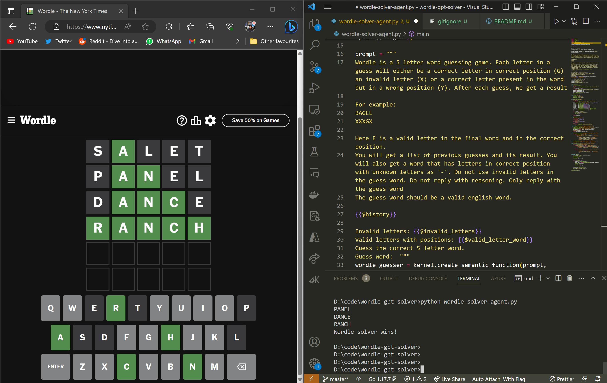

# LLM-Powered Wordle-Solver Agent

This is a Wordle-solving script powered by LLM (Large Language Model) and built using Semantic Kernel and PyAutoGUI.



## Prerequisites

In order to run this program, you will need the following:

- Python 3.7 or higher
- PyAutoGUI library installed
- Semantic Kernel installed 
- OpenAI key

This script works by utilizing the power of LLMs to play Wordle like a Human. The program takes a screenshot of the Wordle game, observes the result colors, and then generates a guess word based on the history and the letters available in the puzzle. 

The program then uses PyAutoGUI, a library for automation of keyboard and mouse functions, to input the potential solutions into the Wordle game and check their correctness. It repeats this process until the guess word have been successfully guessed or the number of guesses is reached.

## How to run

Open https://www.nytimes.com/games/wordle/index.html and keep the browser window visible on screen (required for pyautogui)

Add your OpenAI key and orgid in ```.env``` 
```
OPENAI_API_KEY=
OPENAI_ORG_ID=
```

Open a terminal or command prompt and navigate to the directory where the program is located.

Run the program by typing the following command:
```
python wordle-solver-agent.py
```

Sit back and relax as the program solves the puzzle for you!

## Conclusion

While GPT 3.5 struggles, GPT 4 solves with ease. ```prompts``` file contains some versions of the prompt that were tested.  